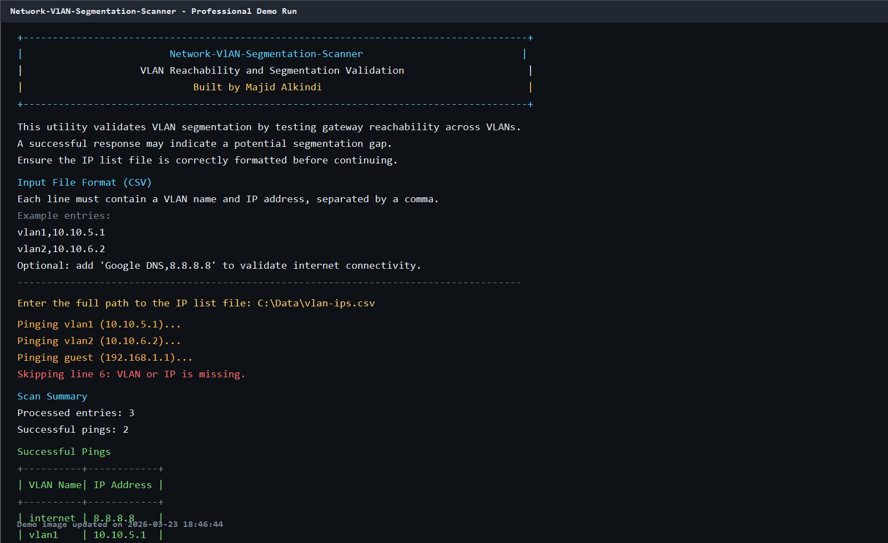

# Network-VlAN-Segmentation-Scanner

Network-VlAN-Segmentation-Scanner is a C# console utility for validating VLAN segmentation by testing reachability to gateway IP addresses across VLAN boundaries.

If a host can successfully ping a gateway in another VLAN, that result may indicate a segmentation gap that should be reviewed.

## Demo



## Key Features

- CSV header validation before processing begins.
- Row-level validation for:
	- missing VLAN or IP values
	- invalid CSV row format
	- invalid IP addresses
- Parallel ping execution for faster scanning of larger input files.
- Clear successful-results table with dynamic column widths.
- Continuous run loop so you can run multiple scans without restarting the tool.

## Requirements

- Windows environment
- .NET SDK installed (compatible with the project target framework: .NET Framework 4.8)

## CSV Input Format

The first row must be a valid header:

- VLAN,IP
- VLAN Name,IP Address

Example file:

```csv
VLAN,IP
vlan1,10.10.5.1
vlan2,10.10.6.2
internet,8.8.8.8
```

Optional internet connectivity check:

```csv
Google DNS,8.8.8.8
```

## Build

From the solution folder:

```powershell
dotnet build VLAN-Segregation-main.sln
```

## Run

Run the compiled executable from:

- bin/Debug/Network-VlAN-Segmentation-Scanner.exe

The tool will prompt for:

- full CSV file path
- rerun or quit after each scan

## Output Behavior

- Valid rows are pinged in parallel.
- Invalid rows are skipped with line-specific warnings.
- A scan summary is shown with:
	- processed entries
	- successful ping count
- Successful results are printed in a formatted table.

## Author

Majid Alkindi.
